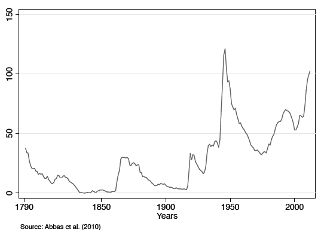
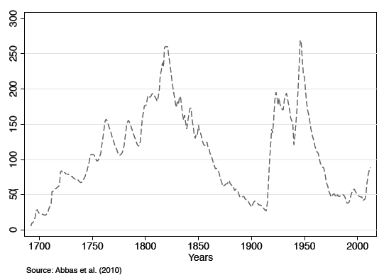
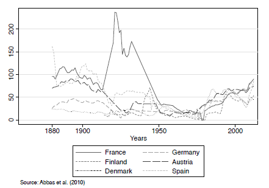

**<u>Summary:</u>**

Governments often accumulate more debt than what would be considered optimal according to fiscal policy theories. This paper explores the political mechanisms that lead to these departures from optimal debt management. It examines the role of political distortions, fiscal rules, and institutional designs that could potentially mitigate these distortions.

**<u>Impact of Political Distortions:</u>**

- **Redistributive Role of Fiscal Policy:**

  - Fiscal policy is deeply intertwined with politics due to its redistributive nature across individuals, regions, and generations. The expansion of welfare states and redistributive programs has intensified the political conflicts surrounding fiscal decisions.

- **Optimal Debt Management Theories:**

  - The authors discuss key theories like Barro’s tax-smoothing hypothesis and analyze deviations from these optimal policies, particularly within OECD countries. Theories of optimal debt policies often fall short in practical applications, as shown by historical evidence of debt accumulation during non-crisis periods.

- **Excessive Debt Accumulation:**
  - Political budget cycles, wars of attrition, and strategic use of debt by governments are identified as primary reasons for excessive debt accumulation. These mechanisms often delay necessary fiscal stabilizations and contribute to higher debt levels than what would be considered optimal.

**<u>Testing for Deficit Bias:</u>**

To assess the deficit bias in modern economies, the study reviews historical evidence and theoretical models:

- **Historical Debt Patterns:** Figures 1 and 2 provide historical data on public debt ratios in the USA and UK, highlighting the significant increases during wars and economic recessions. However, they also show deviations from optimal debt levels during peacetime, suggesting political influences on fiscal decisions.

- **War of Attrition Model:** The paper discusses the war of attrition model, where political groups delay necessary fiscal adjustments to avoid bearing the costs of stabilization. This delay results in the accumulation of excessive debt, as shown by the empirical evidence from OECD countries.

- **Political Budget Cycles:** The study analyzes how political budget cycles, where governments increase spending or cut taxes before elections, contribute to the deficit bias. These cycles are more pronounced in systems with lower transparency and less informed voters.

**<u>Results:</u>**

- **Empirical Evidence:** The study provides empirical evidence showing that many countries accumulate debt beyond optimal levels due to political distortions. For example, the data show significant debt accumulation in countries like Italy and Greece during the 1980s and 1990s, even in the absence of major economic crises.

- **Fiscal Rules:** The effectiveness of fiscal rules, such as balanced budget requirements, is examined. The paper debates the trade-offs between the rigidity of these rules and the need for flexibility in fiscal management. While such rules can mitigate excessive deficits, they are often difficult to enforce due to political resistance.

**<u>Takeaways:</u>**

The findings suggest that political distortions play a significant role in the accumulation of government debt. While fiscal rules can help manage deficits, the deep-rooted political influences require careful consideration in the design of these rules. The paper concludes that addressing the political economy of debt is crucial for achieving optimal fiscal outcomes.

[Publication Link](https://www.sciencedirect.com/science/article/abs/pii/S157400481600015X)

[SSRN Link](https://papers.ssrn.com/sol3/papers.cfm?abstract_id=2706322)
