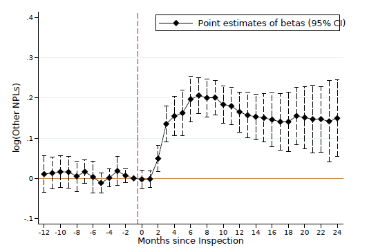
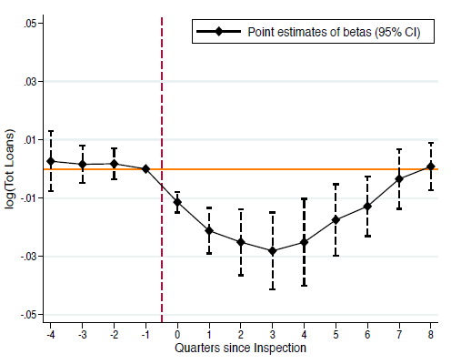
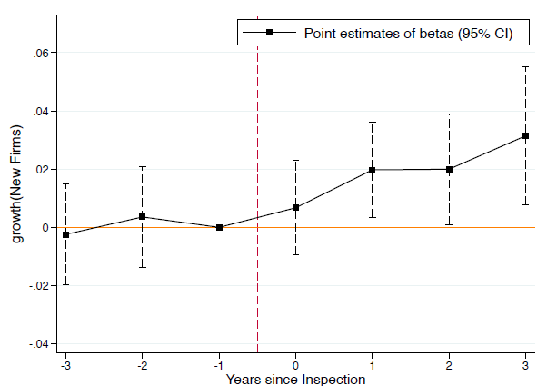
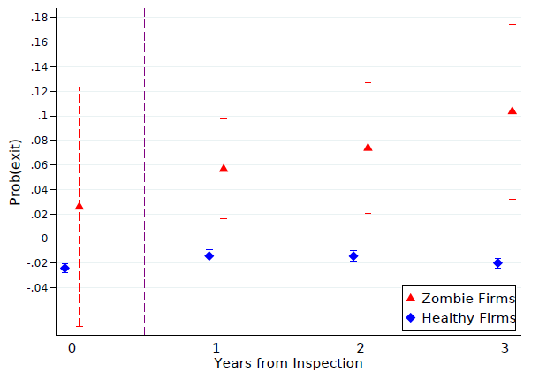

<!-- The Real Effects of Bank Supervision: Evidence from On-Site Bank Inspections with [Paolo Angelini](https://www.bancaditalia.it/chi-siamo/organizzazione/ac/vigilanza-bancaria-finanziaria/angelini/index.html?com.dotmarketing.htmlpage.language=1), [Francesca Lotti](https://sites.google.com/site/francescalotti/francescalotti-homepage?authuser=0) and Giovanni Soggia -->

**Presented:** CEMFI, Purdue University Kranner School of Management, FED Board, FRBNY, John Hopkins SAIS, Brandeis International Business School, Boston FED, Queen Mary University of London, Goldman Sachs, NERA, FIRS 2021, MFA 2021, EFA 2021, SFS Cavalcade North America 2021, Global Finance Conference 2021, WFA 2021, CAFRAL Reserve Bank of India, NFA 2021, FMA 2021, 2021 Community Banking in the 21st Century Research and Policy Conference, University of Cagliari

- Awarded the [2021 EFA Best Paper Award in Institutions and Markets](https://easternfinance.org/best-paper-awards-of-2021/)
- Awarded the [2021 WFA Elsevier Sponsored Award for the best paper on financial institutions](https://westernfinance.org/wp-content/uploads/2021.links_.pdf)
- Semifinalist at the 2021 FMA Annual Meeting for the best paper on financial institutions

**<u>Summary:</u>**

Bank supervision is a critical component of financial regulation, designed to ensure the stability and integrity of financial institutions. This paper focuses on the **real effects** of bank supervision, specifically through **on-site inspections**, on the allocation of credit and broader economic outcomes. Using a novel dataset from Italy, where the Bank of Italy conducts unexpected and rigorous audits of banks, the authors investigate how these inspections impact banks' lending behaviors, governance structures, and the economic health of the regions they serve. The findings reveal that on-site inspections not only lead to more accurate loan classifications but also drive a reallocation of credit towards more productive firms, ultimately benefiting the real economy.

**<u>Impact of Bank Supervision:</u>**

  <!-- left side: content -->
  

  <strong>Loan Reclassification:</strong> The short-run impact of on-site inspections is the <strong>reclassification of loans</strong> as non-performing. Inspections uncover instances where banks have previously misreported the quality of their loans, often to avoid recognizing losses that would adversely affect their balance sheets. By forcing banks to reclassify underperforming loans, the inspections ensure that the banks’ financial statements reflect a more accurate and transparent view of their actual risk exposure.
  

  <!-- right side: image and text under it -->
  

    
    
<strong>Figure 1: Impact of Inspections on NPL Ratios</strong> 
   

  

  <!-- left side: content -->
  

<strong>Credit Supply Adjustment:</strong>  Inspections lead to a **temporary contraction in lending**, primarily affecting loans to underperforming or “zombie” firms—those that are struggling to survive but continue to receive credit. By cutting off these unproductive loans, banks reallocate their resources to healthier, more productive firms. This reallocation not only enhances the efficiency of credit allocation but also stimulates **investment and employment** in sectors that contribute more significantly to economic growth.

- **Governance and Internal Controls:** Beyond immediate financial adjustments, inspections also prompt changes in the **governance and internal controls** of the banks. The turnover of board members increases following inspections, as do efforts to strengthen internal monitoring processes. These changes help to reduce moral hazard and align the interests of bank management with regulatory requirements and long-term financial stability. The inspections, therefore, act as a catalyst for broader organizational improvements that can have lasting benefits for the bank's performance and the economy.

**<u>Testing the Impact:</u>**

The study employs a dynamic Difference-in-Differences (DiD) model to robustly estimate the causal effects of bank inspections. By comparing banks that were inspected with those that were eligible but not selected for inspection, the authors control for potential selection biases and isolate the impact of the inspections themselves.

- **Loan Classification:** The analysis shows that banks increase the stock of loans classified as Non-Performing Loans (NPLs) by approximately 3.6% following an inspection. This significant uptick in NPL classification is indicative of the inspections’ effectiveness in uncovering and correcting misreported loan statuses.

- **Credit Reallocation:** The study finds that inspections result in a 66% reduction in credit extended to zombie firms. This substantial decrease in unproductive lending highlights the role of inspections in preventing the misallocation of financial resources. Instead, credit is redirected towards firms with better growth prospects, leading to more efficient use of capital within the economy.

**<u>Results:</u>**

- **Economic Spillovers:** The reallocation of credit from unproductive to productive firms following inspections generates **positive spillovers** in the local economy. Regions with higher exposure to inspected banks experience increased rates of entrepreneurship, higher overall productivity, and a rebound in employment. These benefits suggest that the effects of bank inspections extend beyond the individual banks to positively influence broader economic outcomes in the regions they serve.

- **Productivity Gains:** The exit of underperforming firms, facilitated by the tightening of credit following inspections, contributes to an overall improvement in economic productivity. This **selection effect**—whereby less competitive firms are weeded out and more competitive firms thrive—enhances the long-term health of the local economy and supports sustainable economic growth.

**<u>Takeaways:</u>**

The findings of this study provide compelling evidence that **rigorous bank supervision**, particularly through on-site inspections, is essential for maintaining the health of the financial system and promoting economic efficiency. By enforcing stricter loan classifications and encouraging better governance practices, inspections help to mitigate the risks associated with zombie lending and ensure that credit is allocated to the most productive uses. This not only stabilizes the financial sector but also drives broader economic growth.

**<u>Policy Implications:</u>**

- **Market Discipline:** The study underscores the importance of **robust bank supervision** as a complement to financial regulation. By disciplining banks and ensuring accurate reporting, supervision helps to maintain market confidence and financial stability.

- **Targeted Inspections:** The findings suggest that targeted inspections, especially for banks with a high proportion of underperforming loans, can have significant **positive effects** on the economy. Policymakers should consider prioritizing resources for the supervision of banks that are most likely to benefit from these interventions.

- **Governance Reforms:** The results highlight the need for ongoing **governance reforms** within banks. Inspections not only enforce compliance with existing regulations but also drive improvements in internal controls and governance practices. This ensures that banks are better equipped to manage risks and support economic growth in the long term.

[Suggested Citation](/posts/research/the-real-effects-of-bank-supervision-evidence-from-on-site-bank-inspections/suggested_citation_bibtex.pdf)

[Paper Link](/posts/research/the-real-effects-of-bank-supervision-evidence-from-on-site-bank-inspections/real_effect_banking_inspection_august2021.pdf)
